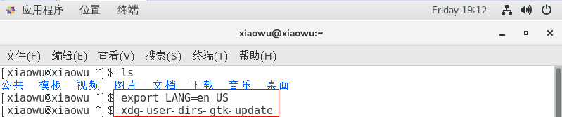
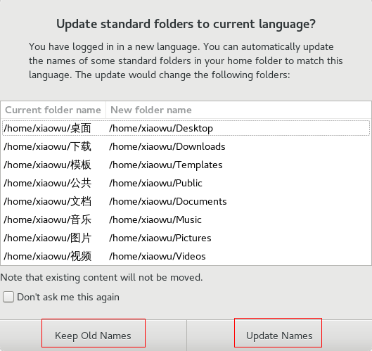
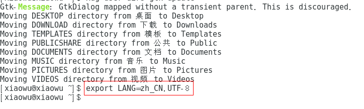
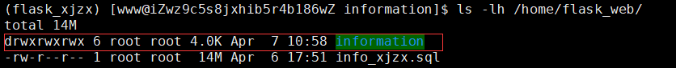

# Centos7系统配置


### 将系统语言改成中文

虚拟机上安装好Centos7后，将语言改成中文，文件目录显示英文，此时需要配置以下参数：




手动选择更新新的文件目录名称



最后再执行如下命令还原到系统之前的设置：




### Centos7 vim显示行号

```
输入命令： vim /etc/vimrc
在vimrc 文件的最后添加： set nu
保存： wq
手动加载配置： source /etc/bashrc
这样不管是哪个用户vim下都显示行号
```


### 给用户添加sudo权限

1. 切换到root用户下

   ```shell
   su root
   ```

2. 添加sudo文件的写权限,命令是:

   ```shell
   chmod u+w /etc/sudoers
   ```

3. 编辑sudoers文件

   ```shell
   vim /etc/sudoers
   ```


   找到这行 root ALL=(ALL) ALL,在他下面添加xxx ALL=(ALL) ALL (这里的xxx是你的用户名)

   可以在sudoers文件中添加下面四行中任意一条：
   youuser      ALL=(ALL)        ALL
   %youuser      ALL=(ALL)        ALL
   youuser      ALL=(ALL)        NOPASSWD: ALL
   %youuser      ALL=(ALL)        NOPASSWD: ALL

   第一行:允许用户youuser执行sudo命令(需要输入密码).
   第二行:允许用户组youuser里面的用户执行sudo命令(需要输入密码).
   第三行:允许用户youuser执行sudo命令,并且在执行的时候不输入密码.
   第四行:允许用户组youuser里面的用户执行sudo命令,并且在执行的时候不输入密码。

4. 撤销sudoers文件写权限,命令:

   ```shell
   chmod u-w /etc/sudoers
   ```


### 创建帐号

1. 新增项目管理帐号

   ```shell
   useradd www -g www  # 创建新用户并把它放在新的组里，不在默认的组
   passwd www  # 设置密码
   ```

2. 修改项目目录的权限

   ```shell
   sudo chmod -R 777 /home/flask_web/inform
   ```

   


