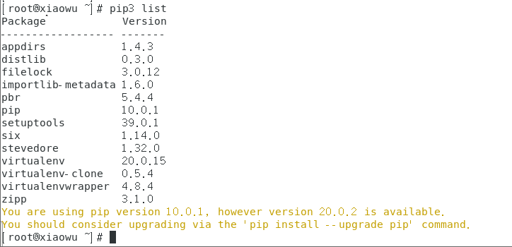
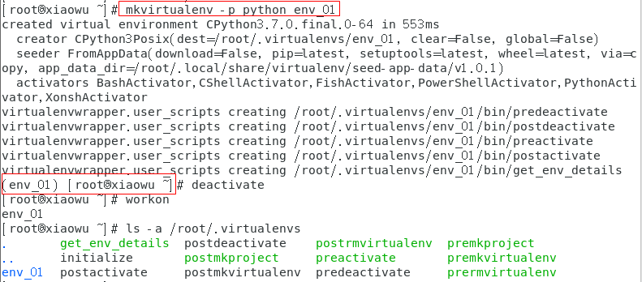
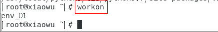
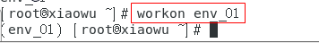
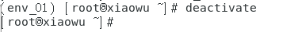
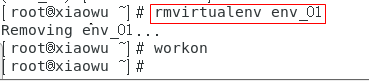

# 安装python虚拟环境


1. 先创建一个隐藏目录 `.virtualenvs`， 所有的虚拟环境都放在此目录下

   ```shell
   [root@xiaowu ~]# mkdir /root/.virtualenvs
   ```

2. 安装虚拟环境

   ```shell
   [root@xiaowu ~]# pip3 install virtualenv
   [root@xiaowu ~]# pip3 install virtualenvwrapper
   ```

   

3. 配置环境

   ```shell
   # 查找virtualenvwrapper.sh路径
   [root@xiaowu ~]# find / -name virtualenvwrapper.sh
   # 我的结果  /usr/local/bin/virtualenvwrapper.sh    （备用）
   
   # 查找virtualenv的路径
   [root@xiaowu ~]# find / -name virtualenv
   # 我的结果  /usr/local/python3/bin/virtualenv    （备用
   ```

   

   ```shell
   [root@xiaowu ~]# vim ~/.bashrc
   ```

   在文件底部增加最后四行

   ```shell
   export WORKON_HOME=$HOME/.virtualenvs # 指定virtualenvwrapper环境的目录
   export VIRTUALENVWRAPPER_PYTHON=/usr/local/bin/python3 # 指定virtualenvwrapper通过哪个python版本来创建虚拟环境
   export VIRTUALENVWRAPPER_VIRTUALENV=/usr/local/python3/bin/virtualenv  # 指定virtualenv的路径
   source /usr/local/python3/bin/virtualenvwrapper.sh  # 指定virtualenvwrapper.sh路径
   ```

   运行如下命令，使配置生效

   ```shell
   [root@xiaowu ~]# source ~/.bashrc
   ```

4. 创建虚拟环境

   ```shell
   [root@xiaowu ~]# mkvirtualenv -p python3 py3_flask  # 创建python3的虚拟环境
   ```

   


### 如何使用虚拟环境

- 查看虚拟环境的命令：

  ```
  workon
  ```

  

  

- 使用虚拟环境的命令：

  ```
  workon env_01
  ```

  

  

- 退出虚拟环境

  ```
  deactivate
  ```

  

- 删除虚拟环境

  ```
  先退出： deactivate
  再删除： rmvirtualenv env_01
  ```

  