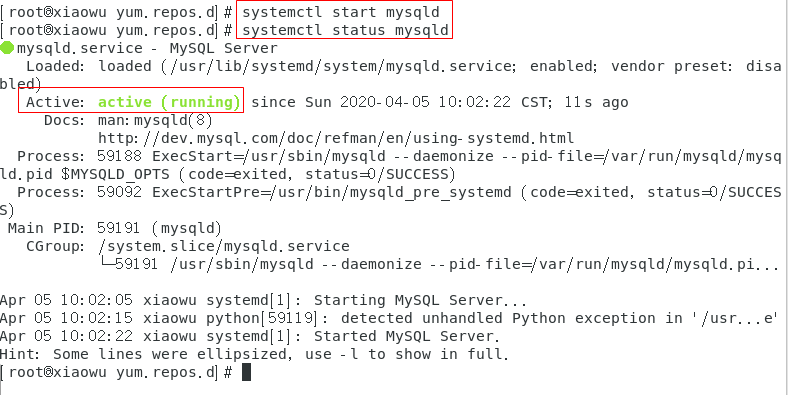
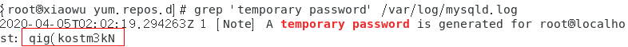
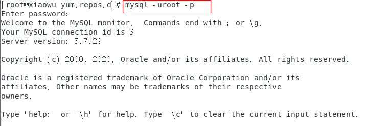
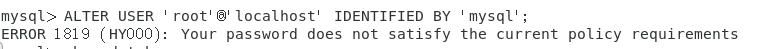
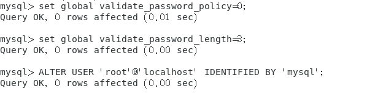

# 安装MySQL

### 在Centos7下安装MySQL5.7：

1. 下载MySQL

   ```
   wget https://dev.mysql.com/get/mysql57-community-release-el7-9.noarch.rpm
   ```

2. 然后进行repo的安装

   ```
   rpm -ivh mysql57-community-release-el7-9.noarch.rpm
   ```

   执行完成后会在`/etc/yum.repos.d/`目录下生成两个repo文件`mysql-community.repo` 和  `mysql-community-source.repo` 。

3. 安装命令

   **必须进入到 /etc/yum.repos.d/目录后再执行以下脚本**

   ```
   yum install mysql-server
   ```

4. 启动MySQL

   ```
   systemctl start mysqld
   ```

   


5. 在每一次登录时，需要获取安装时的临时密码，以便稍后重置密码。

   ```shell
   grep 'temporary password' /var/log/mysqld.log
   ```



6. 使用临时密码登录

   ```mysql
   mysql -uroot -p
   ```

   

7. 修改密码

   ```mysql
   mysql> alter user 'root'@'localhost' identified by 'mysql';
   ```

   

8. 修改两个全局参数

   ```mysql
   mysql> set global validate_password_policy=0; # 修改密码复杂度
   mysql> set global validate_password_length=1;  # 修改密码的长度
   ```

   

9. 再次修改密码

   ```mysql
   mysql> alter user 'root'@'localhost' identified by 'mysql';
   ```

   

10. 授权其它机器登录

    ```mysql
    mysql> GRANT ALL PRIVILEGES ON *.* TO 'root'@'%' IDENTIFIED BY 'mysql' WITH GRANT OPTION;
    mysql> FLUSH  PRIVILEGES;
    ```

    

11. 导入数据

    ```mysql
    # 创建数据库
    create database info_xjzx charset='utf8';
    
# 先登录MySQL： mysql -uroot -p
    use info_xjzx
    source information.sql
    ```
    
    


