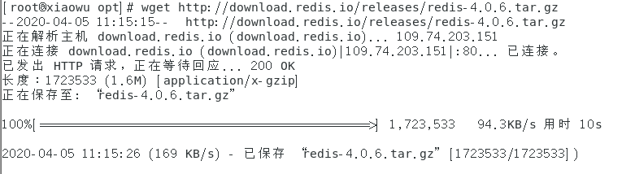
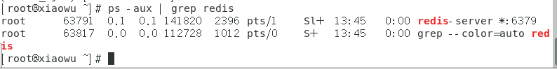
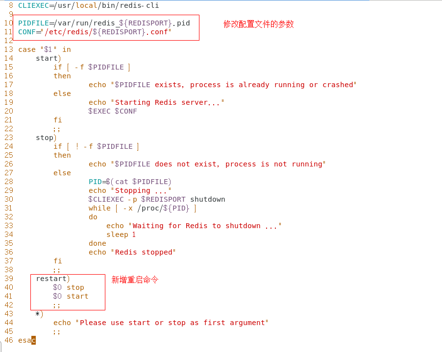
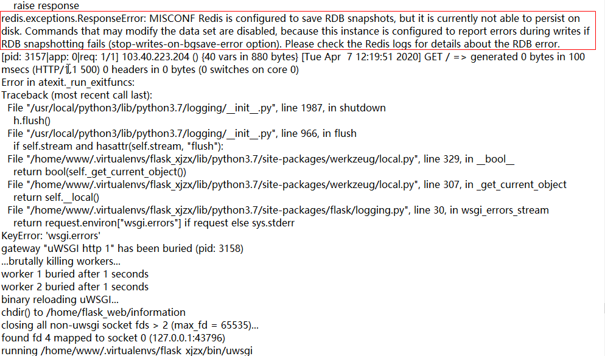
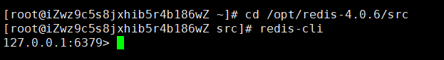
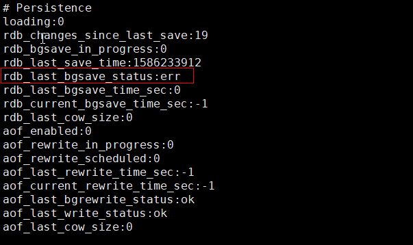

# Centos7下安装Redis

#### 一、安装Redis

1. 下载redis安装包

   ```
   wget http://download.redis.io/releases/redis-4.0.6.tar.gz
   ```

   


2. 解压压缩包

   ```
   tar -zxvf redis-4.0.6.tar.gz
   ```

   

3. 跳转到redis解压目录下

   ```
   cd redis-4.0.6
   ```

4. 编译安装

   ```shell
   make MALLOC=libc
   
   # 将/usr/local/redis-4.0.10/src目录下二进制文件安装到/usr/local/bin
   cd src && make install
   ```

5. 启动Redis

   ```shell
   [root@xiaowu redis]# cd /opt/redis-4.0.6/src/
   [root@xiaowu src]# redis-server
   ```

6. 查看redis进程

   ```shell
   ps -aux | grep redis
   ```

   

7. 关闭redis进程

   ```
   kill 63791
   ```

   


#### 二、配置Redis

- 把redis配置为随机启动，类似于windows的服务，开机启动。

- centos下配置随机启动需要在目录`/etc/init.d`中添加启动脚本，启动脚本的模板在redis源代码目录的utils文件夹中：`redis_init_script`。


1. 将redis_init_script文件复制一份到/etc/init.d文件夹中，并重命令为redis_6379，我们这个服务名也就为redis_6379了。

```shell
cp /opt/redis-4.0.6/utils/redis_init_script /etc/init.d/
cd /etc/init.d/
mv redis_init_script redis_6379
```


2. 编辑文件

   ```
   vim redis_6379
   ```

   



​	**注意：/etc/redis/目录还没有，需要手动创建。**


3. 创建`/etc/redis`目录，并将redis源码中的`redis.conf`文件复制到/etc/redis/目录下。

   ```shell
   mkdir /etc/redis/  # 创建目录
   cp /opt/redis-4.0.6/redis.conf /etc/redis/
   cd /etc/redis/
   mv redis.conf 6379.conf  # 重命名配置文件
   ```

4. 修改6379.conf配置文件

   ```shell
   # 注释掉它，以便让外网访问
   69 # bind 127.0.0.1
   
   # 关闭保护模式
   88 protected-mode no
   
   # 指定Redis监听端口，默认端口为6379
   # 如果指定0端口，表示Redis不监听TCP连接
   92 port 6379
   
   # Redis默认不是以守护进程的方式运行，可以通过该配置项修改，使用yes启用守护进程
   # 启用守护进程后，Redis会把pid写到一个pidfile中，在/var/run/redis.pid
   136 daemonize yes
   
   # 当Redis以守护进程方式运行时，Redis默认会把pid写入/var/run/redis.pid文件，可以通过pidfile指定
   158 pidfile /var/run/redis_6379.pid
    
    
    
   # 工作目录.
   # 指定本地数据库存放目录，文件名由上一个dbfilename配置项指定
   #
   # Also the Append Only File will be created inside this directory.
   #
   # 注意，这里只能指定一个目录，不能指定文件名
   264 dir /var/redis/6379
   ```
   
   注意：最后一行`/var/redis/6379`这个目录还没有，需要手动创建，用于存放redis的持久化文件。


5. 现在可以直接以服务的形式启动和关闭redis了

   ```shell
   service redis_6379 start
   service redis_6379 stop
   service redis_6379 restart
   ```

   

### 异常解决：




大意为：（错误）misconf redis被配置以保存数据库快照，但misconf redis目前不能在硬盘上持久化。用来修改数据集合的命令不能用，请使用日志的错误详细信息。

1. 登录客户端

   ```
   redis-cli
   ```

   

2. 查看redis快照的状态

   ```
   info
   ```

   

3. 修改 `/etc/redis/6379.conf` 文件

   ```
   sudo vim /etc/redis/6379.conf +235
   ```

   