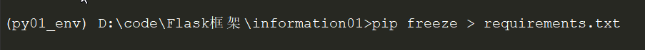
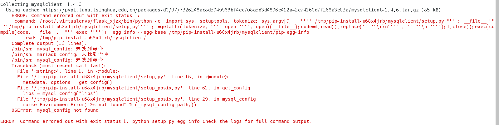
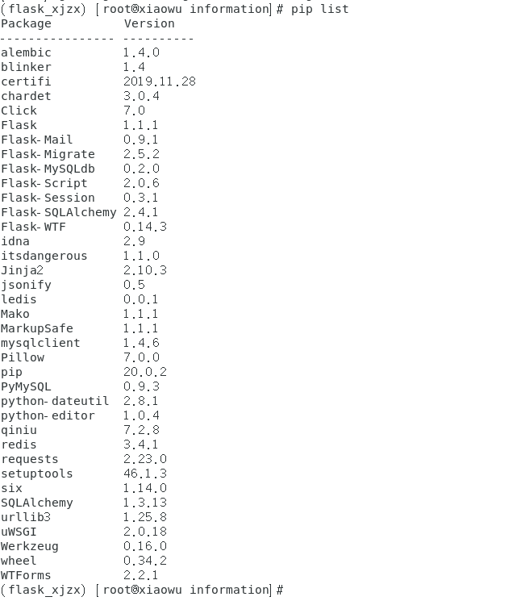

# 安装项目所需要的依赖包

- 在windows下备份项目所有的安装包

  ```
  pip freeze > requirements.txt
  ```

  

- 在Centos7系统安装所需要的依赖

  ```
  pip install -i https://pypi.tuna.tsinghua.edu.cn/simple/ -r requirements.txt
  ```

  

  **在安装mysqlclient==1.4.6时报错了， 经百度还需要安装一个依赖包 `yum -y install mysql-devel `**

- 再次安装项目所需要的包就可以了。

  