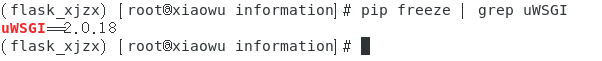
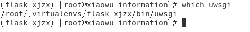
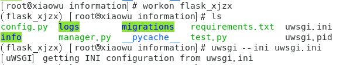
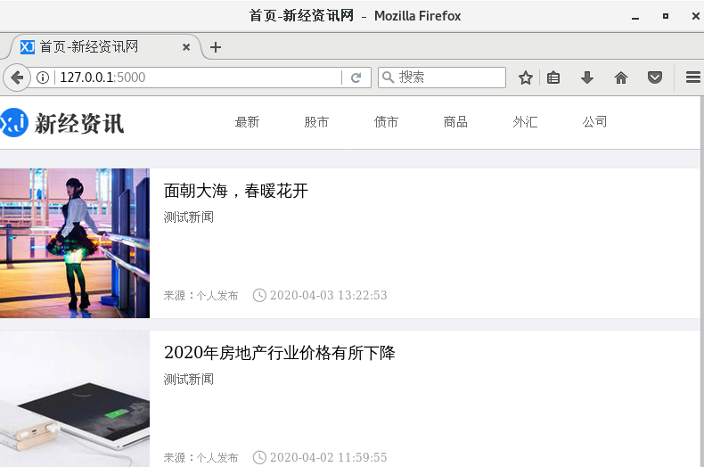

### 配置uwsgi


1. 安装uwsgi

   ```shell
   (flask_xjzx) [root@xiaowu information]# pip install uwsgi
   ```
   



2. 查看uwsgi安装位置

   

3. 编辑配置参数

   在项目的根目录下创建`uwsgi.ini`配置文件

   ```shell
   [uwsgi]
    
   # uwsgi 启动时所使用的地址与端口
   #socket = 127.0.0.1:5000
   http = 0.0.0.0:5000
   
   # 项目目录
   chdir = /home/flask_web/information
   
   # python 启动程序文件
   wsgi-file = manager.py
   
   module = manager  # 项目的启动脚本名字，不能是路径，和wsgi-file功能类似
   # python 程序内用以启动的application变量名（app是manager.py程序文件内的一个变量，这个变量是Flask的application类）
   callable = app
   
   processes = 2  # worker进程个数
   
   threads = 4  # 每个进程的线程数
   
   master = true  # 启用主进程
   
   daemonize = logs/uwsgi.log
   
   pidfile = uwsgi.pid
   
   # 虚拟环境的路径
   home = /root/.virtualenvs/flask_xjzx
   ```

4. 启动uwsgi查看效果

   ```shell
   uwsgi --ini uwsgi.ini  # 启动
   uwsgi --reload uwsgi.pid  # 重启
   uwsgi --stop uwsgi.pid  # 停止
   ```

   

5. 生成uwsgi日志文件

   

6. 通过http://127.0.0.1:5000 可以正常访问网站了

   

