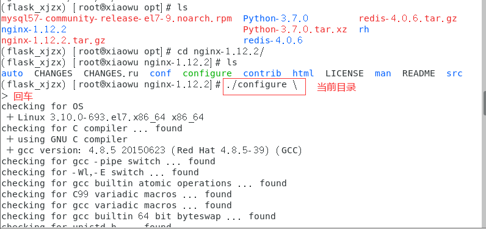

# 部署nginx

### 一、安装nginx

1. 下载 nginx (下载到/opt目录下)

   ```
   wget -c https://nginx.org/download/nginx-1.12.2.tar.gz
   ```

   

2. 解压

   ```
   tar -zxvf nginx-1.12.2.tar.gz
   ```

   

3. 编译

   ```
   ./configure \
   ```

   

4. 安装

   ```
   make && make install
   ```

   提示默认将nginx 安装到了 /usr/local/ 下

   

5. 创建软链接

   ```
   ln -s /usr/local/nginx/sbin/nginx    /usr/bin/nginx
   ```

   

6. 启动 nginx

   

7. 查看应用程序的端口号

   ```shell
   losf -i:80  # 查看指定端口运行的应用程序
   ss -tnlp | grep nginx  # 查看应用程序的端口号
   ss -tnlp | grep :80  # 查看端口所运行的应用程序
   ```

   

   

8. nginx默认是在运行在80端口上的，现在可以访问了

   


### 二、配置nginx

1. 备份配置文件

   

   

2. 编辑配置文件

   ```
   vim nginx.conf
   ```

   
   
   保存并退出文件后，可使用`nginx -t`来检查配置是否有语法错误。

3. 修改uwsgi.ini配置文件

   ```
   socket = 127.0.0.1:5000
   ```

4. 启动nginx

   ```
   先启动uwsgi： uwsgi --ini uwsgi.ini
   再启动nginx： nginx
   编辑完配置文件可使用 nginx -s reload 来重新加载nginx
   ```

5. 测试效果

   

