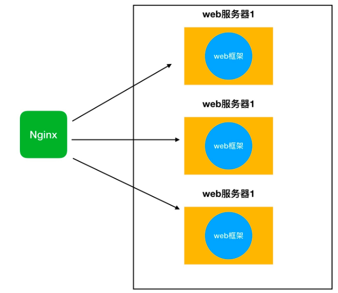

# uwsgi、wsgi和nginx的区别和关系

## 区分uWSGI和WSGI

在python web开发中，我们经常使用uwsgi配合nginx部署一个web框架，如`Django`或`flask`。同时我们又会说，框架和web服务器之间要符合WSGI协议。那就来厘清一下这几个概念。

### web服务器和web框架

在讲uWSGI和WSGI之前，先要弄清楚web开发的两大块，web服务器和web框架。
web服务器即用来接受客户端请求，建立连接，转发响应的程序。至于转发的内容是什么，交由web框架来处理，即处理这些业务逻辑。如查询数据库、生成实时信息等。Nginx就是一个web服务器，Django或flask就是web框架。

### 回到uWSGI和WSGI。

那么如何实现uWSGI和WSGI的配合呢？如何做到任意一个web服务器，都能搭配任意一个框架呢？这就产生了**WSGI协议**。只要web服务器和web框架满足WSGI协议，它们就能相互搭配。所以WSGI只是一个协议，一个约定。而不是python的模块、框架等具体的功能。

而`uWSGI`，则是实现了**WSGI协议**的一个**web服务器**。即用来接受客户端请求，转发响应的程序。实际上，一个`uWSGI`的web服务器，再加上`Django`这样的web框架，就已经可以实现网站的功能了。那为什么还需要Nginx呢？

### 为什么需要Nginx

一个普通的个人网站，访问量不大的话，当然可以由uWSGI和Django构成。但是一旦访问量过大，客户端请求连接就要进行长时间的等待。这个时候就出来了分布式服务器，我们可以多来几台web服务器，都能处理请求。但是谁来分配客户端的请求连接和web服务器呢？Nginx就是这样一个管家的存在，由它来分配。这也就是由Nginx实现反向代理，即代理服务器。

